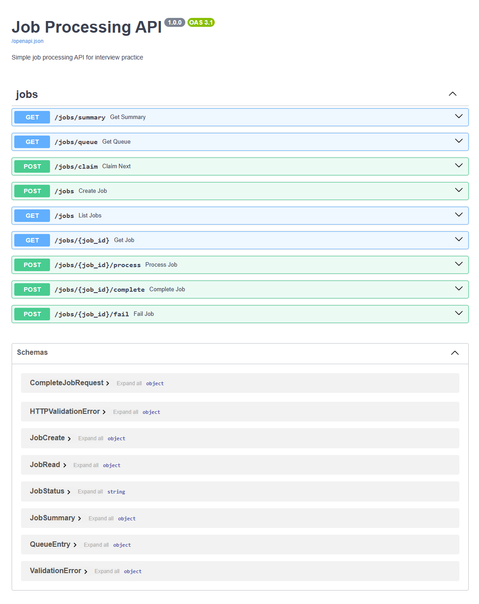

# Job Processing API

A small FastAPI service for creating, tracking, and processing jobs.

The project uses FastAPI, SQLAlchemy, SQLite, and an in-memory priority queue. It supports basic job lifecycle operations like creating jobs, claiming the next job, marking jobs as completed or failed, and viewing status summaries.



## Live Demo

* Backend: https://job-processing-api.alanluu.net/docs

## Features

* Create and list jobs
* Get a job by ID
* Process a specific pending job
* Claim the next pending job from an in-memory priority queue
* Complete or fail jobs
* View job status counts
* Inspect the current queue for debugging
* Validate request and response data with Pydantic
* Store job data in SQLite
* Run tests with pytest
* Run locally or with Docker

## Tech Stack

* Python
* FastAPI
* SQLAlchemy
* SQLite
* Pydantic
* pytest
* Docker

## Job Lifecycle

Jobs move through the following statuses:

```text
PENDING -> RUNNING -> COMPLETED
PENDING -> RUNNING -> FAILED
```

A job starts in `PENDING` status when it is created.

From there, it can be claimed or processed, which moves it to `RUNNING`.

A running job can then be completed or failed.

## API Endpoints

| Method | Endpoint                  | Description                               |
| ------ | ------------------------- | ----------------------------------------- |
| `POST` | `/jobs`                   | Create a new job                          |
| `GET`  | `/jobs`                   | List jobs                                 |
| `GET`  | `/jobs/{job_id}`          | Get a single job                          |
| `POST` | `/jobs/{job_id}/process`  | Process a specific pending job            |
| `POST` | `/jobs/{job_id}/complete` | Complete a running job                    |
| `POST` | `/jobs/{job_id}/fail`     | Mark a job as failed                      |
| `POST` | `/jobs/claim`             | Claim the next pending job from the queue |
| `GET`  | `/jobs/queue`             | View current in-memory queue entries      |
| `GET`  | `/jobs/summary`           | Get job counts by status                  |

## Example Request

Create a job:

```json
{
  "type": "image_resize",
  "payload": {
    "image_url": "https://example.com/image.png",
    "width": 300,
    "height": 300
  },
  "priority": 5
}
```

Example response:

```json
{
  "id": "job-id",
  "type": "image_resize",
  "payload": {
    "image_url": "https://example.com/image.png",
    "width": 300,
    "height": 300
  },
  "priority": 5,
  "status": "PENDING",
  "result": null,
  "created_at": "2026-01-01T12:00:00",
  "started_at": null,
  "completed_at": null
}
```

## Queue Behavior

The app includes an in-memory priority queue for claiming pending jobs.

Higher priority jobs are claimed first. If two jobs have the same priority, the older job is claimed first.

The database is still the source of truth. The queue only stores candidate job IDs. If a job is manually processed, completed, or failed, the queue may temporarily contain stale entries. The claim logic checks the database before starting a job and skips anything that is no longer pending.

## Project Structure

```text
app/
  main.py
  db.py
  models.py
  schemas.py
  crud.py
  services.py
  queue.py
  routers/
    jobs.py

tests/
  test_api.py

Dockerfile
requirements.txt
README.md
```

## Files of Interest

| File                  | Purpose                               |
| --------------------- | ------------------------------------- |
| `app/main.py`         | FastAPI app setup                     |
| `app/routers/jobs.py` | API routes                            |
| `app/models.py`       | SQLAlchemy database models            |
| `app/schemas.py`      | Pydantic request and response models  |
| `app/crud.py`         | Database operations                   |
| `app/services.py`     | Business logic and state transitions  |
| `app/queue.py`        | In-memory priority queue              |
| `app/db.py`           | Database connection and session setup |

## Running Locally

Install dependencies:

```bash
pip install -r requirements.txt
```

Run the app:

```bash
uvicorn app.main:app --reload --port 8080
```

Open the API docs:

```text
http://127.0.0.1:8080/docs
```

## Running Tests

```bash
pytest
```

Or:

```bash
python -m pytest -v
```

## Running with Docker

Build the image:

```bash
docker build -t job-processing-api .
```

Run the container:

```bash
docker run --rm -p 8080:8080 job-processing-api
```

Then open:

```text
http://127.0.0.1:8080/docs
```

If the container logs show that Uvicorn is running on port `8000`, use this instead:

```bash
docker run --rm -p 8080:8000 job-processing-api
```

## Database

The app uses SQLite by default:

```text
sqlite:///./jobs.db
```

This keeps setup simple for local development.

For a production version, I would move the database to PostgreSQL or another managed SQL database so data persists across deployments and works better with multiple app instances.

## Design Notes

The project is split into layers:

* Routes handle HTTP requests and responses.
* Schemas define the API contract.
* Services contain business rules and state transitions.
* CRUD functions handle database reads and writes.
* The queue handles priority ordering for pending jobs.

This keeps the code easier to test and easier to change.

## Limitations

This project is intentionally simple.

The in-memory queue works for local development and interview practice, but it is not shared across multiple app instances. If the service restarts, the queue is reset.

For production, I would use a more durable queue or a database-backed claiming strategy.
